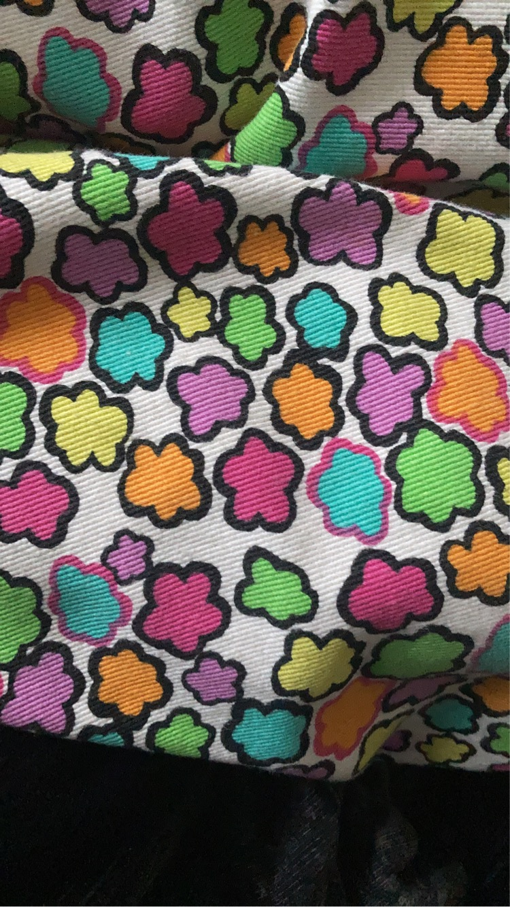
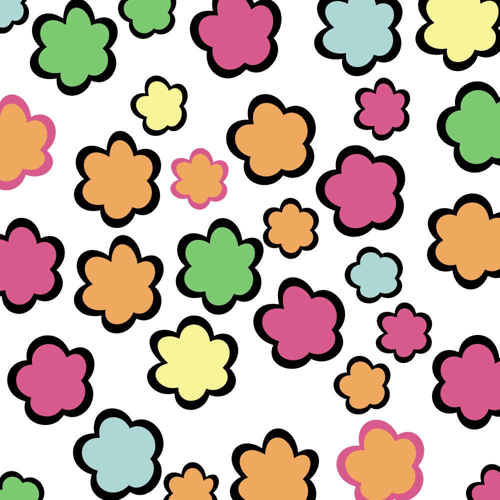

# A flower pattern in P5Js

## Two versions in two different branches:

## This is the original trouser pattern which I was trying to replicate:

### A quadratic vertex approach, which is more star like

### A bezier curve approach, which is more circular

